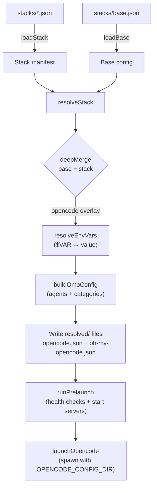

# OCS — OpenCode Stack Switcher

<p>
  
  
  
  
</p>

Manage and switch OpenCode configuration stacks (AI models for agents, subagents, and categories).

---

## 🚀 Quick Start

```bash
# Initialize from your current opencode config
ocs init

# List available stacks
ocs list

# Use a stack
ocs use <stack-name>

# Check system health
ocs doctor
```

## 🎯 About

OCS allows you to quickly switch between different OpenCode configurations without manual file editing. Each stack defines:
- Models for specific agents (oracle, sisyphus, etc.)
- Models for categories (visual-engineering, ultrabrain, etc.)
- Provider configurations
- Local servers for prelaunch (MCP, tools)
- Environment variables

### Prerequisites

Before using OCS, you must have:

1. **[OpenCode](https://github.com/opencode-ai/opencode)** - The main OpenCode CLI tool
2. **[Oh My OpenAgent](https://github.com/code-yeongyu/oh-my-openagent)** - Plugin that enables model per-agent/category configuration (REQUIRED)

OCS **requires** the oh-my-opencode plugin to function. Without it, the stack system won't work because OCS generates `oh-my-opencode.json` files for each stack.

## 📦 Installation

### Prerequisites

Before installing OCS, make sure you have:

1. **[OpenCode CLI](https://github.com/opencode-ai/opencode)** installed
2. **[Oh My OpenAgent](https://github.com/code-yeongyu/oh-my-openagent)** plugin installed and configured

```bash
# Install OpenCode (if not already installed)
# See: https://github.com/opencode-ai/opencode#installation

# Install Oh My OpenAgent plugin (REQUIRED for OCS)
# See: https://github.com/code-yeongyu/oh-my-openagent#installation
```

⚠️ **OCS requires oh-my-opencode** - This plugin is essential as OCS generates `oh-my-opencode.json` files to configure models per-agent/category.

### Install OCS

```bash
# Option A: npm (recommended for end users)
npm install -g ocs

# Option B: bun
bun add -g ocs

# Option C: git (for development)
git clone https://github.com/stanl33y/opencode-stack-switcher.git
cd opencode-stack-switcher
bun install
bun link
```

## 🛠️ Development Setup

### Prerequisites

- [Bun](https://bun.sh/) >= 1.0
- [OpenCode CLI](https://github.com/opencode-ai/opencode)
- [Oh My OpenAgent](https://github.com/code-yeongyu/oh-my-openagent) plugin

### Quick Start

1. Clone the repository:

```bash
git clone https://github.com/stanl33y/opencode-stack-switcher.git
cd opencode-stack-switcher
```

2. Install dependencies:

```bash
bun install
```

3. Set up environment variables:

```bash
cp .env.example .env
# Edit .env with your API keys
```

The `.env` file supports these variables:

| Variable | Required | Description |
|----------|----------|-------------|
| `OPENAI_API_KEY` | One of | OpenAI API key |
| `OPENROUTER_API_KEY` | these | OpenRouter API key |
| `ZAI_API_KEY` | | ZAI API key |
| `EDITOR` | No | Editor for `ocs edit` (defaults to `$EDITOR`, then `vi`) |
| `OPENCODE_CONFIG_DIR` | No | Override OpenCode config dir (defaults to `~/.config/opencode`) |

4. Verify installation:

```bash
chmod +x scripts/verify-cold-install.sh
./scripts/verify-cold-install.sh
```

The verification script clones to a temp directory, installs deps, runs `ocs init`, and tests `ocs list`. It confirms the project works from a cold start with no prior configuration.

5. Run the development server:

```bash
bun run dev
```

### Testing

```bash
bun test              # Run all tests
bun test --coverage   # With coverage report
bun run typecheck     # TypeScript type checking
bun run lint          # Biome lint and format
```

### Development Tips

- Run `ocs doctor` to check system health at any time
- Use `ocs edit <stack>` to modify stack manifests with your preferred editor
- The verification script ensures the project can be set up from scratch without any prior configuration

## 🚀 Usage

### Commands

```bash
# Interactive menu
ocs

# Use a specific stack
ocs use <stack>

# List available stacks
ocs list

# Show resolved configuration of a stack
ocs show <stack>

# Show current stack
ocs current

# Check system health
ocs doctor

# Edit stack manifest
ocs edit <stack>

# Validate stack manifest (schema + security checks)
ocs validate <stack>

# Compare two stacks side by side
ocs diff <stack-a> <stack-b>

# Initialize base.json from global opencode config
ocs init
```

### Pass-through arguments

```bash
ocs use my-stack -- --help  # args after -- go to opencode
```

## 📁 Stack Structure

```json
{
  "name": "my-stack",
  "description": "Description of my stack",
  "opencode": {
    "model": "openai:gpt-4o",
    "small_model": "openai:gpt-4o-mini"
  },
  "omo": {
    "default_model": "openai:gpt-4o-mini",
    "agents": {
      "oracle": "openai:gpt-4o",
      "sisyphus": "openai:gpt-4o"
    },
    "categories": {
      "ultrabrain": "openai:o1-preview"
    }
  },
  "prelaunch": [
    {
      "name": "mcp-server",
      "check": { "tcp": 3000 },
      "start": "node mcp-server/index.js",
      "cwd": "./mcp-server",
      "timeoutMs": 30000
    }
  ],
  "env": {
    "MY_VAR": "value"
  }
}
```

## 🛡️ Security

⚠️ **NEVER** commit stacks with secrets or API keys.

Use `.local.json` files for private configurations:

```bash
# Private stack (not committed)
stacks/my-stack.local.json

# Public stack (safe)
stacks/example.json
```

The `.gitignore` already excludes `*.local.json` and `stacks/*.json` to prevent secret leaks.

### API Key Configuration

Use environment variables, not stack files:

```bash
export OPENAI_API_KEY="sk-..."
export OPENROUTER_API_KEY="sk-or-..."
export ZAI_API_KEY="zai-..."

ocs use my-stack
```

## 🔧 How It Works



When you run `ocs use <stack>`, the pipeline flows like this:

1. **loadStack** reads `stacks/<stack>.json` and validates it with zod
2. **loadBase** reads `stacks/base.json` (your default opencode config)
3. **resolveStack** deep merges the base config with the stack's opencode overlay
4. **resolveEnvVars** substitutes `$VAR` and `${VAR}` references with environment values
5. **buildOmoConfig** generates the oh-my-opencode plugin config from agent/category model assignments
6. **Write** outputs `resolved/<stack>/opencode.json` and `oh-my-opencode.json`
7. **runPrelaunch** checks health of configured local servers, starts any that aren't running
8. **launchOpencode** spawns opencode with `OPENCODE_CONFIG_DIR` pointing to the resolved stack directory

## 📝 Example Stack

See `stacks/example.json` for a safe reference configuration.

## 🐛 Troubleshooting

### "stacks/base.json missing"
```bash
ocs init
```

### Server doesn't start in prelaunch
```bash
ocs doctor  # Check ports and health-checks
```

### Stack not showing in list
Check if the file is in `stacks/` and has `.json` extension.

### "oh-my-opencode.json not found" or models not applying

OCS **requires** the [oh-my-opencode](https://github.com/code-yeongyu/oh-my-openagent) plugin to be installed:

```bash
# Check if plugin is installed
opencode plugin list

# If not installed, install it:
opencode plugin install oh-my-openagent
```

Without this plugin, OCS will generate `oh-my-opencode.json` files but OpenCode won't use them to configure models per agent/category.

## 📄 License

MIT

## 🤝 Contributing

Contributions are welcome! See [CONTRIBUTING.md](CONTRIBUTING.md) for guidelines.

## 📚 Resources

- [OpenCode](https://github.com/opencode-ai/opencode)
- [Oh My OpenAgent](https://github.com/code-yeongyu/oh-my-openagent)